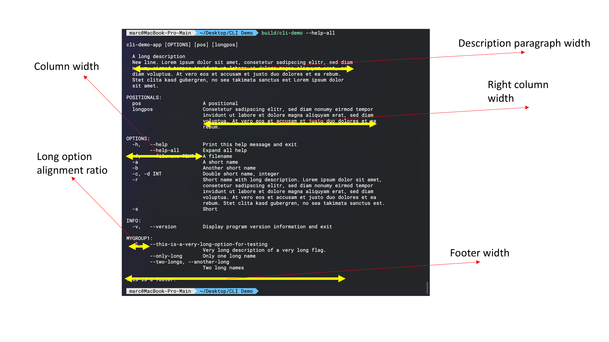

# Formatting help output

## Customizing an existing formatter

In CLI11, you can control the output of the help printout in full or in part.
The default formatter was written in such a way as to be customizable. You can
use `app.get_formatter()` to get the current formatter. The formatter you set
will be inherited by subcommands that are created after you set the formatter.

There are several configuration options that you can set:

| Set method                                 | Description                                                          | Availability |
| ------------------------------------------ | -------------------------------------------------------------------- | ------------ |
| `column_width(width)`                      | The width of the columns (30)                                        | Both         |
| `label(key, value)`                        | Set a label to a different value                                     | Both         |
| `long_option_alignment_ratio(float)`       | Set the alignment ratio for long options within the left column(1/3) | Both         |
| `right_column_width(std::size_t)`          | Set the right column width(65)                                       | Both         |
| `description_paragraph_width(std::size_t)` | Set the description paragraph width at the top of help(88)           | Both         |
| `footer_paragraph_width(std::size_t)`      | Set the footer paragraph width (88)                                  | Both         |
| `enable_description_formatting(bool)`      | enable/disable description paragraph formatting (true)               | Both         |
| `enable_footer_formatting(bool)`           | enable/disable footer paragraph formatting (true)                    | Both         |
| `enable_option_defaults(bool)`             | enable/disable printing of option defaults (true)                    | Both         |
| `enable_option_type_names(bool)`           | enable/disable printing of option types (true)                       | Both         |
| `enable_default_flag_values(bool)`         | enable/disable printing of default flag values (true)                | Both         |

Labels will map the built in names and type names from key to value if present.
For example, if you wanted to change the width of the columns to 40 and the
`REQUIRED` label from `(REQUIRED)` to `(MUST HAVE)`:

```cpp
app.get_formatter()->column_width(40);
app.get_formatter()->label("REQUIRED", "(MUST HAVE)");
```

Used labels are `REQUIRED`, `POSITIONALS`, `Usage`, `OPTIONS`, `SUBCOMMAND`,
`SUBCOMMANDS`, `Env`, `Needs`,`Excludes`, and any type name such as `TEXT`,
`INT`,`FLOAT` and others. Replacing these labels with new ones will use the
specified words in place of the label.

### Customization Option Descriptions

Some of the control parameters are visualized in Figure 1. They manage the
column widths and ratios of the different sections of the help



### long option alignment ratio

The long option alignment ratio controls the relative proportion of short to
long option names. It must be a number between 0 and 1. values entered outside
this range are converted into the range by absolute value or inversion. It
defines where in the left column long optiosn are aligned. It is a ratio of the
column width property.

### formatting options

There are occasions where it is necessary to disable the formatting for headers
and footers the two options `enable_description_formatting(false)` and
`enable_footer_formatting(false)` turn off any formatting on the description and
footer. This allows things like word art or external management of alignment and
width. With formatting enabled the width is enforced and the paragraphs
reflowed.

### Option output control

Additional control options manage printing of specific aspects of an option

```text
OPTIONS:
  -h,   --help           Print this help message and exit
        --opt TEXT [DEFFFF]
  -o,   --opt2 INT       this is a description for opt2
  -f, -n, --opt3, --option-double FLOAT
                         this is a description for option3
        --flag, --no_flag{false}
                         a flag option with a negative flag as well
```

The `[DEFFFF]` portion, which is the default value for options if specified can
be turned off in the help output through `enable_option_defaults(false)`. The
`TEXT`, `INT`, `FLOAT` or other type names can be turned off via
`enable_option_type_names(false)`. and the `{false}` or flag default values can
be turned off using `enable_default_flag_values(false)`.

## Subclassing

You can further configure pieces of the code while still keeping most of the
formatting intact by subclassing either formatter and replacing any of the
methods with your own. The formatters use virtual functions most places, so you
are free to add or change anything about them. For example, if you wanted to
remove the info that shows up between the option name and the description:

```cpp
class MyFormatter : public CLI::Formatter {
  public:
    std::string make_option_opts(const CLI::Option *) const override {return "";}
};
app.formatter(std::make_shared<MyFormatter>());
```

Look at the class definitions in `FormatterFwd.hpp` or the method definitions in
`Formatter.hpp` to see what methods you have access to and how they are put
together.

## Anatomy of a help message

This is a normal printout, with `<>` indicating the methods used to produce each
line.

```text
<make_description(app)>
<make_usage(app)>
<make_positionals(app)>
  <make_group(app, "Positionals", true, filter>
<make_groups(app, mode)>
  <make_group(app, "Option Group 1"), false, filter>
  <make_group(app, "Option Group 2"), false, filter>
  ...
<make_subcommands(app)>
  <make_subcommand(sub1, Mode::Normal)>
  <make_subcommand(sub2, Mode::Normal)>
<make_footer(app)>
```

`make_usage` calls `make_option_usage(opt)` on all the positionals to build that
part of the line. `make_subcommand` passes the subcommand as the app pointer.

The `make_groups` print the group name then call `make_option(o)` on the options
listed in that group. The normal printout for an option looks like this:

```text
        make_option_opts(o)
            ┌───┴────┐
 -n,--name  (REQUIRED)      This is a description
└────┬────┘                └──────────┬──────────┘
make_option_name(o,p)        make_option_desc(o)
```

Notes:

- `*1`: This signature depends on whether the call is from a positional or
  optional.
- `o` is opt pointer, `p` is true if positional.

## formatting callback

For certain cases it is useful to use a callback for the help formatting

```c++
app.formatter_fn(
    [](const CLI::App *, std::string, CLI::AppFormatMode) { return std::string("This is really simple"); });
```

This callback replaces the make_help call in the formatter with the callback.
This is a wrapper around a custom formatter that just needs the main call. All
configuration options are available but are ignored as the output is purely
driven by the callback. The first argument is a const pointer to the App in
question. The formatter will get a std::string usage name as the second option,
and a AppFormatMode mode for the final option. It should return a std::string.
The `AppFormatMode` can be `Normal`, `All`, or `Sub`, and it indicates the
situation the help was called in. `Sub` is optional, but the default formatter
uses it to make sure expanded subcommands are called with their own formatter
since you can't access anything but the call operator once a formatter has been
set.
